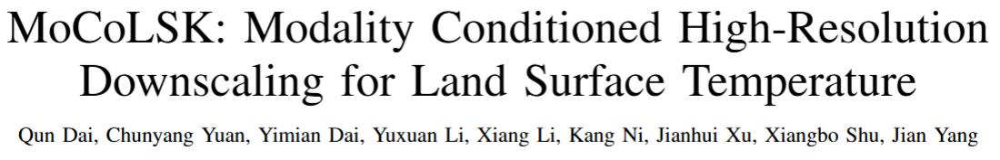
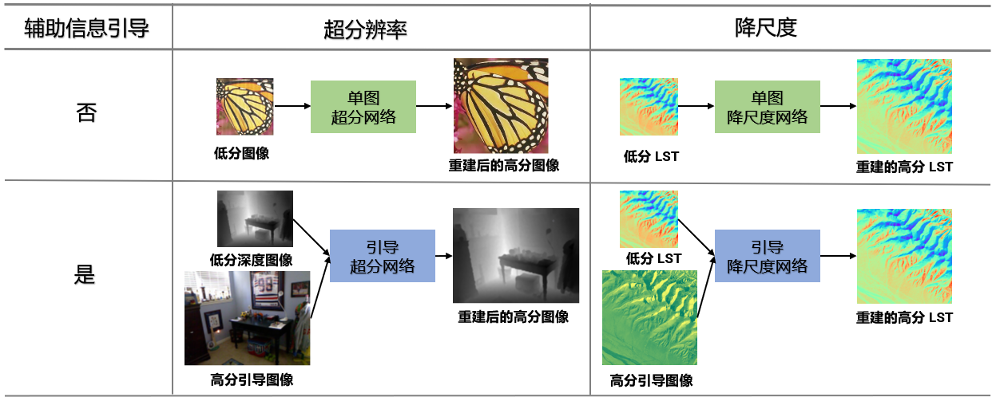
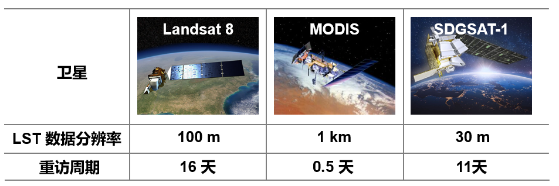
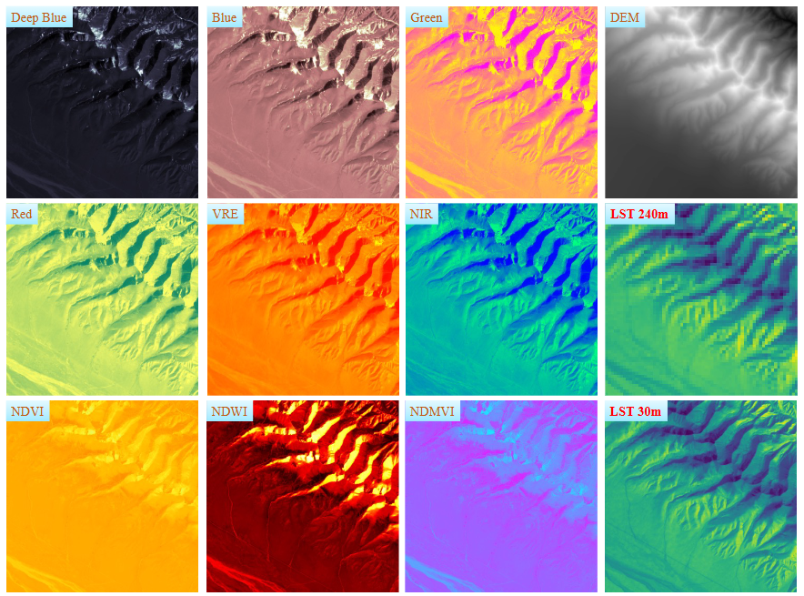
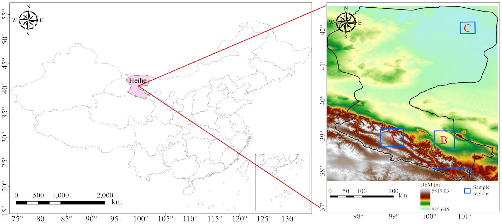
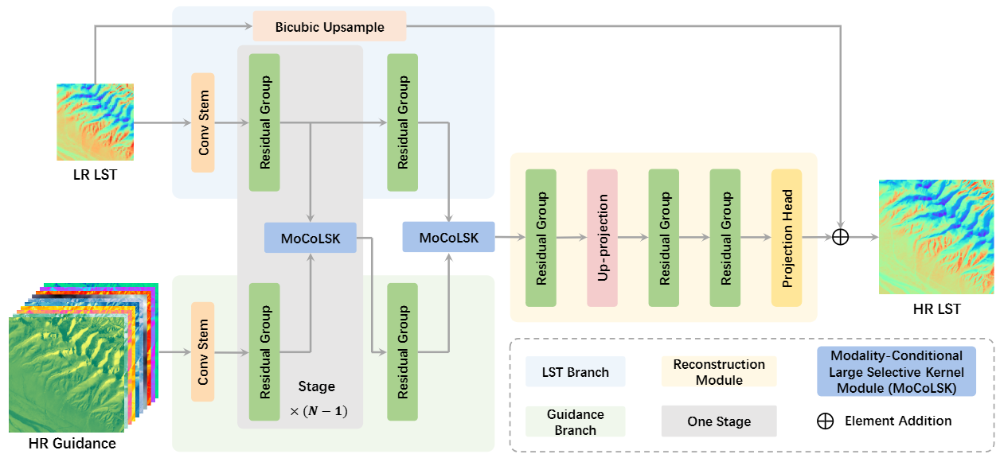
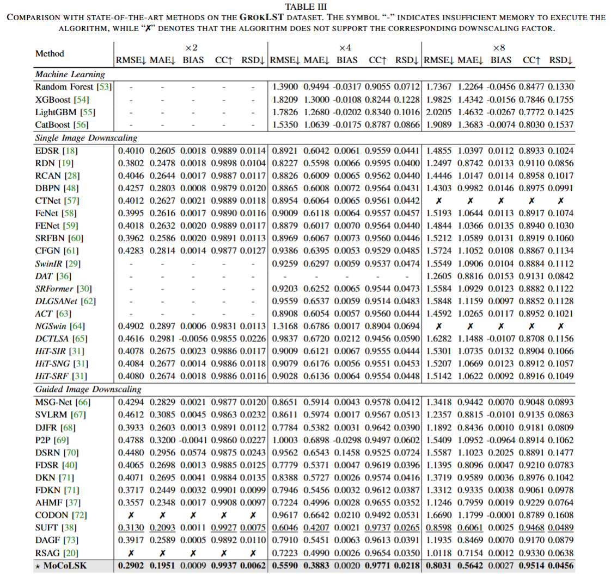
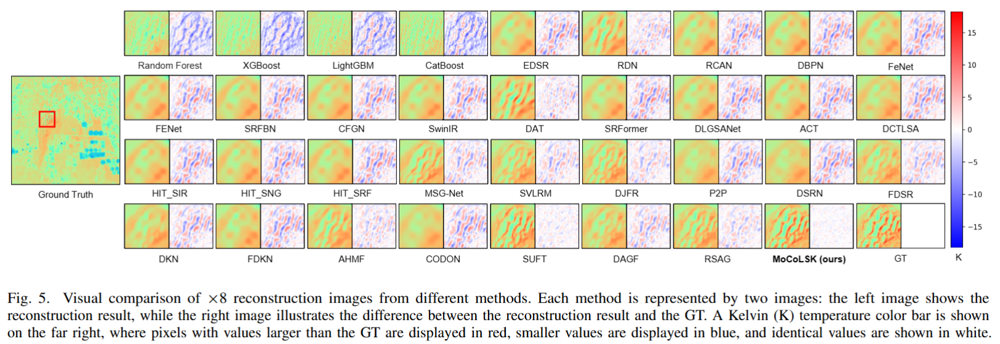

# 
<!--  -->

<!-- Qun Dai, Chunyang Yuan, Yimian Dai, Yuxuan Li, Xiang Li, Kang Ni, Jianhui Xu, Xiangbo Shu, Jian Yang -->

戴群, 袁春阳, 戴一冕, 李宇轩, 李翔, 倪康, 许剑辉, 舒祥波, 杨健

**arXiv 地址**：[https://arxiv.org/abs/2409.19835](https://arxiv.org/abs/2409.19835)

**开源地址**：[https://github.com/GrokCV/GrokLST](https://github.com/GrokCV/GrokLST)

**一句话概括本文：**

我们开源了首个为地表温度降尺度设计的高分辨率开源基准数据集 **[GrokLST](https://github.com/GrokCV/GrokLST)** ，并开发了一个包含40多种降尺度（超分）方法的工具箱——**[GrokLST Toolkit](https://github.com/GrokCV/GrokLST)**。不仅如此，我们还提出了一种模态条件大选择性卷积核网络 **[ MoCoLSK-Net](https://arxiv.org/abs/2409.19835)**，能够动态融合高分辨率引导信息，以显著提升重建性能。

---
**关键术语解释：**

  
  <figcaption> 图 1 降尺度和超分辨率，不同的术语，相同的含义 </figcaption>

**1. 地表温度（Land Surface Temperature，LST）是什么？** 地表温度即地球表面区域的温度。

**2. 什么是降尺度 (Downscaling)？** 降尺度技术类似于计算机视觉领域的超分辨率，即将低分辨率图像重建为高分辨率图像，如图1所示。

**3. 地表温度降尺度（Land Surface Temperature Downscaling）是什么？** 本质上是将低分辨率的地表温度数据重建为高分辨率地表温度数据。

**4. 引导地表温度降尺度（Guided Land Surface Temperature Downscaling）是什么？** 利用同一时间和区域的其他高分辨率模态数据（如光学图像等）作为引导信息，以辅助低分辨率地表温度数据的重建，如图1所示。

---
# 研究背景

  
  <figcaption> 图 2 地表温度数据的广泛应用 <a href="http://www.cbas.ac.cn/news/202409/t20240906_800280.html" target="_blank">（图片来源）</a> </figcaption>

地表温度（Land Surface Temperature, LST）作为地表与大气间物质与能量交换的核心物理参数，在评估生态和气候变化动态方面具有重要作用 [[1]](#ref1)。LST 数据广泛应用于多个领域 [[2]](#ref2) [[3]](#ref3)，包括气象监测与预报、城市热岛效应分析、农业监测、自然灾害评估和蒸散发速率估算等，是遥感、生态学和气候学等学科进行环境监测和研究的关键依据（如图 2 所示）。有关更多应用场景，请点击[链接 1](http://www.cbas.ac.cn/news/202409/t20240906_800280.html)和[链接 2](https://www.cas.cn/yw/202112/t20211220_4818807.shtml)。

为了确保对地表温度分析的准确性，获得高分辨率的 LST 数据至关重要。然而，直接获取高时空分辨率的 LST 数据却并非易事，因为研究先进的成像设备并发射到太空的成本不菲且周期长。另外一种间接的低成本方式就是开发降尺度算法，直接重建低分辨率的 LST 数据以获得期望的高分辨率 LST 数据。该领域发展缓慢的主要原因可能要归咎于相关开源数据集和工具箱的缺乏。
<!-- 提高 LST 数据的分辨率可以更详细地捕捉地表温度的空间变化，从而有助于推动科学研究和实际应用的发展。因此，研究地表温度降尺度方法具有广阔的应用前景和重要的现实意义。 -->

## 相关数据集和工具箱的匮乏

  
  <figcaption> 图 3 Landsat 8、MODIS 和 SDGSAT-1 卫星对比 </figcaption>

近年来，深度学习技术已被广泛应用于提高地表温度分辨率的研究中，成为降尺度的有效方案 [[4]](#ref4)。这些方法借助深度神经网络的特征提取能力，建模输入数据与目标输出之间的复杂关系。然而，相关高质量数据集和工具箱的缺乏极大限制了地表温度降尺度领域繁荣发展的脚步。

高分辨率地表温度（HR LST）数据的获取长期以来受到卫星遥感技术中时间分辨率和空间分辨率的权衡限制。例如，Landsat 8 提供 100 米的空间分辨率，但重访周期为 16 天 [[5]](#ref5)，而 MODIS 尽管能够实现单日两次观测，但空间分辨率较低，仅有 1 公里 [[6]](#ref6)。这种权衡限制了高时空分辨率 LST 数据的获取。
<!-- 此外，热红外波段的低分辨率进一步限制了多光谱数据的协同应用，使得高分辨率地表温度数据的获取更加困难。 -->

  
  <figcaption> 图 4 SDGSAT-1 卫星发射 <a href="https://wenhui.whb.cn/third/baidu/202111/05/432201.html" target="_blank">（图片来源）</a></figcaption>

近年来，我国航空航天领域发展迅猛，取得了一系列突破性进展。2021 年 11 月 5 日，SDGSAT-1 卫星在我国太原卫星发射中心成功发射。该卫星搭载了热红外、微光和多光谱成像仪三个有效载荷。热红外成像仪可通过 30 米分辨率检测地表温度变化（精度达 0.2℃），微光成像仪实现了全球首次同时获取 10 米全色与 40 米彩色微光影像的能力，多谱段成像仪则通过增加红边和深蓝波段来监测植被生长和水质状况。SDGSAT-1 卫星的发射，使得高分辨率（30 米）地表温度数据的获取成为了现实。[点我查看更多关于 SDGSAT-1 卫星的详细信息](https://www.cas.cn/yw/202112/t20211220_4818807.shtml)。

尽管深度学习技术已在图像分类、目标检测、语义分割和图像超分辨率等多个领域取得了显著进展，地表温度降尺度领域的发展仍然滞后。这种滞后主要归因于缺乏高质量的数据集和专用工具箱。据我们所知，目前尚无任何公开可用的**高分辨率地表温度降尺度数据集和工具箱**。
为推动地表温度降尺度领域的发展，我们开源了首个 **高分辨率地表温度降尺度数据集——GrokLST 数据集**，以促进相关研究的快速发展。数据集的相关信息请参见下文 [GrokLST 数据集](#GrokLST-数据集) 章节。
不仅如此，我们还发布了一个**地表温度降尺度工具箱——[GrokLST Toolkit](https://github.com/GrokCV/GrokLST)**，涵盖了 40 多种降尺度算法，旨在进一步推动地表温度降尺度领域的进展。
<!-- 工具箱的详细信息请参见下文 [GrokLST 工具箱](#GrokLST-工具箱) 章节。 -->

## 现有基于深度学习的降尺度方法

<!-- 虽然当前已能够获取 30 米分辨率的地表温度数据（即 LST 图像中每个像素点代表 30m×30m 区域的整体温度），但对于尺度小于 30 米的物体来讲，不能准确分析小尺度物体的精确温度值。因此，30 米分辨率的 LST 仍不够 “精细”。最直接的思路是仅通过对低分辨率（LR）LST 数据进行降尺度重建出更高分辨率（如 10 米、5 米、1 米等）的 LST 数据。 -->

<!-- 实际上，其他模态数据的分辨率可能高于 30 米分辨率的地表温度数据，例如 SDGSAT-1 卫星上的微光成像仪能够捕获 10 米全色数据。因此，为了获取更高分辨率的地表温度数据，基于高分辨率辅助数据的引导式 LST 降尺度技术应运而生。该技术通过利用高分辨率的其他模态数据来引导 LR LST 数据的降尺度，从而重建出 HR LST 数据，如图 1 所示。实验表明，引导式降尺度方法在重建精度上往往优于非引导式方法。相关实验结果详见我们论文 [MoCoLSK: Modality Conditioned High-Resolution Downscaling for Land Surface Temperature](https://arxiv.org/abs/2409.19835) 的 IV.B（Comparison with State-of-the-Arts）小节。 -->

除了传统的降尺度方法 [[7]](#ref7)[[8]](#ref8)（本文主要关注基于深度学习的方法），目前用于 LST 降尺度的深度学习模型可以分为单图降尺度方法和引导降尺度方法，如图1所示。
<!-- 直接应用计算机视觉领域中的单图像超分辨率（Single Image Super-Resolution，SISR）和引导式图像超分辨率（Guided Image Super-Resolution，GISR）模型，如图1所示。 -->
多数方法在设计上未充分考虑 LST 数据的特性及其面临的特殊挑战 [[9]](#ref9)。随着热红外波段分辨率提升至超高水平（≤30 米），建筑物、道路等小尺度局部特征与水体、沙漠、草地等大尺度地表覆盖类型共存。这些局部特征容易与周围环境相互影响，从而增加了降尺度过程的复杂性。

通过对高分辨率 LST 数据的深入分析，我们发现现有方法的两大主要局限：

1. **无法动态调整感受野**：LST 的空间异质性要求模型能够根据不同尺度的温度变化灵活调整感受野，以精确捕捉局部温差。

2. **单一多模态融合方式**：现有方法在多模态辅助数据与 LST 特征的融合中多采用简单操作（如相加、相乘或拼接），无法揭示多模态数据中潜在的复杂依赖关系，导致特征增强效果有限，未能有效利用多模态数据的丰富信息。

基于以上发现，我们设计了 **[MoCoLSK-Net](https://arxiv.org/abs/2409.19835)**，该网络的细节见下文 [**MoCoLSK-Net**](#MoCoLSKNet) 章节。

# GrokLST 数据集

  
  <figcaption> 图 5 GrokLST 数据集各种模态数据的可视化 </figcaption>

**下载链接：**

* [百度网盘](https://pan.baidu.com/s/1-X2PHUBpFiq6JhtUWAUXLw?pwd=Grok)
* [OneDrive](https://1drv.ms/f/s!AmElF7K4aY9pgYEGx82XMMLm3n7zQQ?e=IsfN1I)

有关 GrokLST 数据集更多细节，可参考项目 [GrokLST](https://github.com/GrokCV/GrokLST) 的相关部分。

为填补地表温度降尺度数据集的空白，我们推出了 **GrokLST** 数据集。如图 5 所示，该数据集包含四种分辨率（即 30m、60m、120m 和 240m）的多模态数据，每组数据均包含 641 张 LR LST 数据及 10 种模态的高分辨率引导数据。这 10 种模态分别为：数字高程模型（Digital Elevation Model，DEM）、深蓝波段（Deep Blue）、蓝色波段（Blue）、绿色波段（Green）、红色波段（Red）、植被红边波段（Vegetation Red Edge，VRE）、近红外波段（Near Infrared，NIR）、归一化差值多光谱植被指数（Normalized Difference Multispectral Vegetation Index，NDMVI）、归一化植被指数（Normalized Difference Vegetation Index，NDVI）以及归一化水体指数（Normalized Difference Water Index，NDWI）。**以上数据均为真实数据，而非仿真数据。**

  
  <figcaption> 图 6 GrokLST 数据集的研究区域 </figcaption>

**研究区域**：如图 6 所示，本研究以黑河流域为重点区域。该流域为中国西北地区的第二大内陆河流域，位于东经 98° 至 101°、北纬 38° 至 42° 之间，地处河西走廊内，是甘肃省西部及青海省的主要内陆流域。

部分数据集细节如下：

| 分辨率 | 尺度 | LST 宽 / 高 | 引导数据 宽 / 高 |
| ------ | ---- | ----------- | ---------------- |
| 30m    | GT   | 512/512     | 512/512          |
| 60m    | x2   | 256/256     | 256/256          |
| 120m   | x4   | 128/128     | 128/128          |
| 240m   | x8   | 64/64       | 64/64            |

**数据集的使用方式：**

1. 单图降尺度实验使用举例：使用 60m LST 数据作为网络输入，以 30m LST 数据作为 Ground Truth (GT)，完成两倍 LST 降尺度任务；
2. 引导降尺度方法实验使用举例：以 60m LST 和 30m 引导数据作为网络输入，将 30m LST 数据作为 GT，进行两倍的引导 LST 降尺度任务；
3. 利用不同分辨率的数据，进行不同倍数的 LST 降尺度任务。

<!-- # GrokLST 工具箱

**GrokLST 工具箱地址：**[GrokLST 工具箱](https://github.com/GrokCV/GrokLST)

为了推动地表温度降尺度领域的发展，我们不仅开源了首个**高分辨率地表温度降尺度数据集——GrokLST 数据集**，还开发了一个专用于地表温度降尺度的工具箱——[GrokLST Toolkit](https://github.com/GrokCV/GrokLST)，包含 40 多种降尺度算法，以期加速地表温度降尺度领域的进步。

有关工具箱的详细信息，请参见我们的项目 [GrokLST](https://github.com/GrokCV/GrokLST)。 -->

# MoCoLSK-Net

  
  <figcaption> 图 7 MoCoLSK-Net 网络框架 </figcaption>

我们提出了一种模态条件大选择性卷积核网络——**[MoCoLSK-Net](https://arxiv.org/abs/2409.19835)**，这是一个新型的多模态融合框架，能够动态整合高分辨率引导信息，从而提升 LST 的重建性能，如图 7 所示。

<!-- 该网络基于两点观察：
- 其一，大多数方法无法动态调整感受野；
- 其二，大多数方法仅使用简单的多模态融合策略。

具体而言，随着热红外波段分辨率提升至超高水平（≤30 米），建筑物、道路等小尺度特征与水体、沙漠、草地等大尺度地表覆盖类型共存，导致局部特征与环境混合，增加了降尺度过程的复杂性。因此，设计的网络需要能够依据 LST 数据的具体特征动态调整感受野。例如，对于建筑物、道路等小尺度特征，较小的感受野即可；而面对沙漠、草地等大尺度地表覆盖类型时，网络需动态调整为较大的感受野。

此外，现有方法将多模态辅助数据与 LST 特征的集成局限于简单操作（如相加、相乘或拼接），无法充分揭示复杂依赖关系，导致特征增强效果有限，未能有效利用多模态数据的丰富信息。

因此，我们设计了 MoCoLSK 模块，能够基于高分辨率引导数据的内在特性动态调整网络感受野，充分利用多模态数据信息以增强特征融合效果，提高网络的重建性能。 -->

  
  <figcaption> 图 8 MoCoLSK 模块 </figcaption>

我们基于之前的工作 [LSKNet (IJCV 2024)](https://link.springer.com/article/10.1007/s11263-024-02247-9 "Large Selective Kernel Network for Remote Sensing Object Detection")[[10]](#ref10) 并将其改造成能实现多模态融合的结构，由此设计出了 MoCoLSK 模块。<!-- 如图 8 所示，MoCoLSK 模块包括两个分支，即 large selective kernel (LSK) pathway 和 modality-conditioned weight generation (MCWG) pathway。 -->
如图 8 所示，MoCoLSK 模块由两个路径组成：大选择性核 (LSK) 路径和模态条件权重生成 (MCWG) 路径。

具体而言，在 LST 路径中，模块配置遵循原始 LSK 模块，但有两个关键区别：

1）空间选择掩码的生成通过 MCWG 路径提供的模态条件权重进行调制；

2）输出特征是两个模态特征融合的结果。

在 MCWG 路径中，通过金字塔池模块和 [Dynamic MLP (CVPR 2022)](https://openaccess.thecvf.com/content/CVPR2022/papers/Yang_Dynamic_MLP_for_Fine-Grained_Image_Classification_by_Leveraging_Geographical_and_CVPR_2022_paper.pdf "Dynamic MLPfor Fine-Grained Image Classification by Leveraging Geographical and Temporal Information")[[11]](#ref11) 模块将高分辨率 LST 特征与引导特征结合，动态生成模态条件卷积权重，用于调制 LSK 路径中空间掩模特征的生成。

<!-- 具体来说，LSK 模块中使用了一个 7x7 的逐深度卷积层来生成不同感受野的掩码特征，但这一卷积权重是静态的，缺乏动态适应性。为此，我们通过金字塔池化模块和 [Dynamic MLP (CVPR 2022)](https://openaccess.thecvf.com/content/CVPR2022/papers/Yang_Dynamic_MLP_for_Fine-Grained_Image_Classification_by_Leveraging_Geographical_and_CVPR_2022_paper.pdf "Dynamic MLPfor Fine-Grained Image Classification by Leveraging Geographical and Temporal Information")[[11]](#ref11) 模块构建超网络，充分联合多模态特征以生成动态卷积权重，从而构建出了完整的 MoCoLSK 模块。 -->

更多细节请参考我们的论文：[MoCoLSK: Modality Conditioned High-Resolution Downscaling for Land Surface Temperature](https://arxiv.org/abs/2409.19835)。

# 实验结果

我们基于 GrokLST 工具箱，构建了一套全面的基准评价指标（RMSE、MAE、CC、BIAS 和 RSD）来评估当前主流算法以及 MoCoLSK-Net 在 GrokLST 数据集上的性能表现。我们测试了传统回归算法、单图降尺度算法（如 [RDN](https://openaccess.thecvf.com/content_cvpr_2018/papers/Zhang_Residual_Dense_Network_CVPR_2018_paper.pdf)[[12]](#ref12)）和 引导降尺度算法（如 [RSAG](https://dl.acm.org/doi/10.1609/aaai.v37i3.25440)[[13]](#ref13)）的效果，实验结果和可视化结果分别如图 9 和图 10 所示：

  
  <figcaption> 图 9 传统回归算法、单图降尺度算法以及引导降尺度算法性能对比 </figcaption>

  
  <figcaption> 图 10 可视化结果 </figcaption>

## 主要结论
1. 通常情况下，重建性能表现为：传统回归算法 < 单图降尺度算法 < 引导降尺度算法；
2. 尽管某些 单图降尺度算法（如 [RDN](https://openaccess.thecvf.com/content_cvpr_2018/papers/Zhang_Residual_Dense_Network_CVPR_2018_paper.pdf)[[12]](#ref12)）性能较佳，但基于单图降尺度算法在重建性能上限方面明显低于引导降尺度算法，例如 [RDN](https://openaccess.thecvf.com/content_cvpr_2018/papers/Zhang_Residual_Dense_Network_CVPR_2018_paper.pdf)[[12]](#ref12) 的效果明显不如我们提出的 [MoCoLSK-Net](https://arxiv.org/abs/2409.19835)；
3. 基于 Transformer 的算法与基于空间或通道注意力的卷积算法相比，并不具有明显优势。另外，多数 Transformer 算法仅存在于单图降尺度算法，而鲜有基于 Transformer 的引导降尺度工作，可能由于其不可忽视的难以忍受的巨大计算量；
4. 无论是单图降尺度算法还是引导降尺度算法，其 LST 和 引导数据 都建议都采用 z-score 归一化方法。

<!-- # 本文总结

本文介绍了 **[GrokLST](https://github.com/GrokCV/GrokLST)**，这是首个面向地表温度降尺度的高分辨率开源基准数据集，并提供了包含 40 多种方法的地表温度降尺度工具箱——**[GrokLST Toolkit](https://github.com/GrokCV/GrokLST)**。此外，我们提出了一种模态条件大选择性卷积核网络（**[MoCoLSK-Net](https://arxiv.org/abs/2409.19835)**），能够动态融合高分辨率引导信息，以提升重建性能。 -->

# 致谢

感谢国际可持续发展目标大数据研究中心 ([CBAS](http://www.cbas.ac.cn/zxjs/zxgk/)) 慷慨提供 SDGSAT-1 数据。

# 参考文献

<a name="ref1">[1]</a>: Jia A, Liang S, Wang D. Generating a 2-km, all-sky, hourly land surface temperature product from Advanced Baseline Imager data[J]. Remote Sensing of Environment, 2022, 278: 113105.

<a name="ref2">[2]</a>: Wang D, Chen Y, Hu L, et al. Modeling the angular effect of MODIS LST in urban areas: A case study of Toulouse, France[J]. Remote sensing of Environment, 2021, 257: 112361.

<a name="ref3">[3]</a>: Bai Y, Bhattarai N, Mallick K, et al. Thermally derived evapotranspiration from the Surface Temperature Initiated Closure (STIC) model improves cropland GPP estimates under dry conditions[J]. Remote Sensing of Environment, 2022, 271: 112901.

<a name="ref4">[4]</a>: Lanaras C, Bioucas-Dias J, Galliani S, et al. Super-resolution of Sentinel-2 images: Learning a globally applicable deep neural network[J]. ISPRS Journal of Photogrammetry and Remote Sensing, 2018, 146: 305-319.

<a name="ref5">[5]</a>: Ye X, Hui J, Wang P, et al. A Modified Transfer-Learning-Based Approach for Retrieving Land Surface Temperature From Landsat-8 TIRS Data[J]. IEEE Transactions on Geoscience and Remote Sensing, 2023, 61: 1-11.

<a name="ref6">[6]</a>: Tang W, Zhou J, Ma J, et al. TRIMS LST: a daily 1 km all-weather land surface temperature dataset for China's landmass and surrounding areas (2000–2022)[J]. Earth System Science Data, 2024, 16(1): 387-419.

<a name="ref7">[7]</a>: Guo F, Hu D, Schlink U. A new nonlinear method for downscaling land surface temperature by integrating guided and Gaussian filtering[J]. Remote Sensing of Environment, 2022, 271: 112915.

<a name="ref8">[8]</a>: Hu D, Guo F, Meng Q, et al. A novel dual-layer composite framework for downscaling urban land surface temperature coupled with spatial autocorrelation and spatial heterogeneity[J]. International Journal of Applied Earth Observation and Geoinformation, 2024, 130: 103900.

<a name="ref9">[9]</a>: Sun Y, Deng K, Ren K, et al. Deep learning in statistical downscaling for deriving high spatial resolution gridded meteorological data: A systematic review[J]. ISPRS Journal of Photogrammetry and Remote Sensing, 2024, 208: 14-38.

<a name="ref10">[10]</a>: Li, Y., Li, X., Dai, Y. et al. LSKNet: A Foundation Lightweight Backbone for Remote Sensing. Int J Comput Vis (2024).

<a name="ref11">[11]</a>: Yang L, Li X, Song R, et al. Dynamic mlp for fine-grained image classification by leveraging geographical and temporal information[C]//Proceedings of the IEEE/CVF conference on computer vision and pattern recognition. 2022: 10945-10954.

<a name="ref12">[12]</a>: Zhang Y, Tian Y, Kong Y, et al. Residual dense network for image super-resolution[C]//Proceedings of the IEEE conference on computer vision and pattern recognition. 2018: 2472-2481.

<a name="ref13">[13]</a>: Yuan J, Jiang H, Li X, et al. Recurrent structure attention guidance for depth super-resolution[C]//Proceedings of the AAAI Conference on Artificial Intelligence. 2023, 37(3): 3331-3339.
