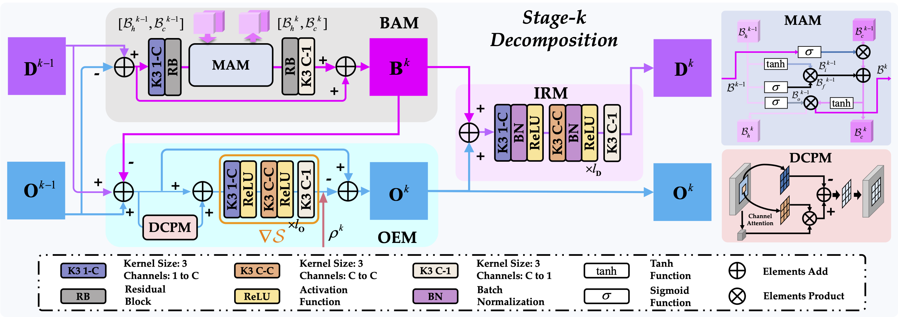
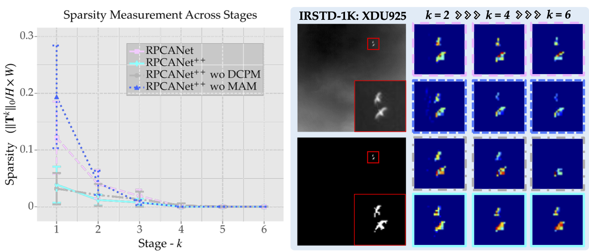
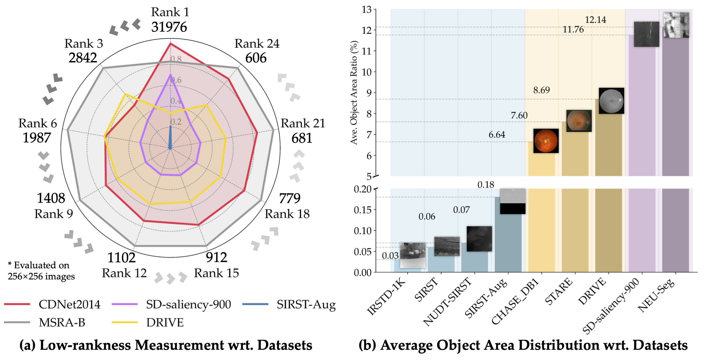
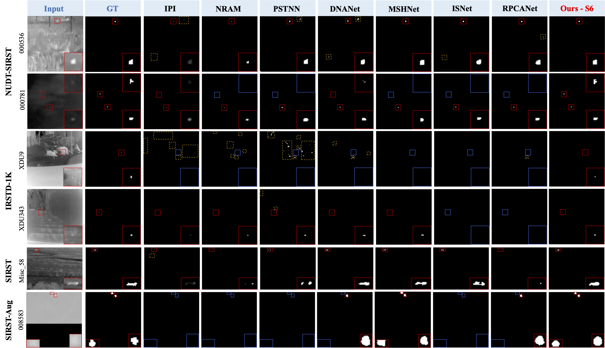
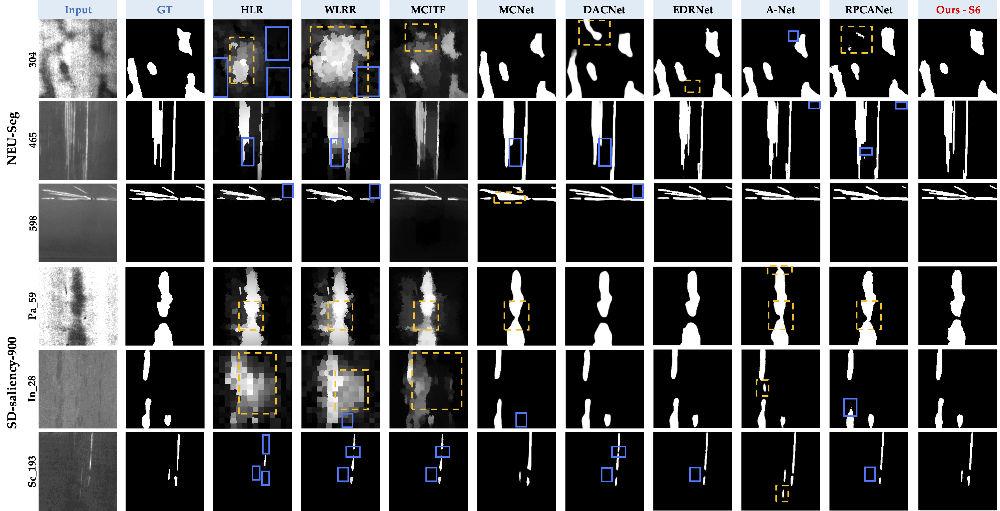

# RPCANet++：深度可解释的稀疏目标分割方法

> **arXiv地址**：https://arxiv.org/abs/2508.04190 
> **项目首页**：https://fengyiwu98.github.io/rpcanetx
> **开源代码**：https://github.com/fengyiwu98/RPCANet
> **深度展开低秩稀疏工具包**：https://pypi.org/project/dulrs
> **简要概括**:  
在稀疏目标分割任务中，传统RPCA方法面临计算成本高昂和泛化能力有限的技术挑战，复杂的矩阵运算会影响实时部署和跨域适应性。为此，我们将RPCA优化问题重新表述为一个可解释的深度展开框架，并提出了RPCANet++，该网络将松弛RPCA模型展开为三个可解释模块，通过记忆增强和深度对比先验实现了背景特征的自适应保持和目标敏感性的动态增强，从而能够在保持理论可解释性的同时提升分割性能。此外，我们提供了一套完整的定性与定量可解释性分析工具包。据我们所知，RPCANet++是首个将深度展开RPCA系统性应用于稀疏目标分割的可解释框架，在红外小目标检测、血管分割和缺陷检测等多个任务上实现了卓越的性能。

图1 RPCANet++范式的整体架构。 A. 在RPCA框架内对给定图像进行数学建模，并将其转换为无约束优化问题。B. 采用闭式解析解迭代求解上述优化模型，同时考虑两个核心技术挑战及其对应的解决方案。C. 将迭代求解过程展开为深度神经网络架构，实现算法到网络的有机融合。D. 通过事后分析技术进行视觉和数值模型验证，全面展现框架的可解释性。

---

## 🪞 研究背景

过去十余年中，鲁棒主成分分析（RPCA）作为PCA的扩展，凭借其对异常值的鲁棒表示能力备受关注。观测矩阵 $\mathbf{D}$ 由低秩矩阵（包含冗余特征）和稀疏矩阵（包含独特对象）组成。这种分解结构广泛应用于低级视觉任务（图像恢复、去噪）和高级视觉任务（前景/背景分离、图像分类），在实际图像分割任务中尤为有效（缺陷检测、血管分割、红外小目标分割等）：将冗余背景信息建模为 $\mathbf{B}$，分割目标建模为稀疏分量 $\mathbf{O}$：

$\mathbf{D} = \mathbf{B} + \mathbf{O}$

这些模型通常表述为凸优化或非凸优化问题，采用增广拉格朗日方法、近端梯度下降或交替方向最小化求解。为提升图像分割性能，模型融入多种约束（目标约束、背景约束、场先验等）。然而，尽管理论上具有吸引力，现有模型仍面临两个关键局限：

**• 计算成本高昂：** 重复的矩阵/张量操作降低收敛速度，阻碍实时部署，特别是在内存受限环境中。

**• 泛化能力受限：** (1) 过度依赖手动超参数调整，导致跨场景性能下降；(2) 刚性先验限制跨领域适应性，制约广泛应用。

深度神经网络（DNNs）和大规模公共数据集的发展推动了图像分割进步，对新兴数据展现更强适应性。FPNs、U-Nets、Transformers、SAM等架构得到广泛应用。然而，其经验性设计往往牺牲可解释性，形成"黑盒"模型，在缺乏特定领域上下文时输出可靠性存疑。

为解决DNNs的可解释性问题，**深度展开网络(DUNs)** 通过将迭代优化算法展开为结构化深度网络，在保持可解释性的同时获得数据驱动的强大性能。DUNs在压缩感知、图像去噪、超分辨率、图像恢复等逆问题中广泛应用。

## 💡 研究动机
尽管深度展开RPCA模型备受关注，但其在分割任务中的应用仍受限于三大核心挑战：（1）动态条件下RPCA关键矩阵操作（SVD、软阈值）的处理复杂性——虽有SVD/ST变体和改进初始化策略，但复杂矩阵计算管理和可学习参数优化仍是开放性问题；（2）中间低秩分量缺乏有效监督机制，尽管稀疏分量已有真实标签；（3）在深度展开网络中，低秩背景估计与稀疏分量检测的协同效应常因阶段性传输损失而减弱，导致背景误估计和目标遗漏。虽然阶段间操作可部分缓解，但无法自适应保持背景特征。

针对上述分析的技术挑战，我们提出**RPCANet++**，一个具有强可解释性的分割框架，该框架将松弛RPCA模型系统性展开为三个核心模块：对象提取模块（OEM）、背景近似模块（BAM）和图像恢复模块（IRM）。不同于传统方法，我们摒弃高复杂度矩阵运算和人工参数设计，采用理论约束驱动的神经网络架构，将低秩背景建模为可学习潜在变量。通过目标与背景的协同建模，实现稀疏目标提取与高质量图像恢复的联合优化。我们还设计了阶段性低秩性和稀疏性量化指标以验证框架的理论遵循度。 **RPCANet++巧妙融合优化理论驱动的模型透明性与深度学习的表征灵活性，为复杂场景下的目标分割提供可靠且高泛化的解决方案。**

## 🔥 RPCANet++ 🔥

### 问题建模、迭代求解与网络展开
在面向分割的RPCA任务中，我们的目标是估计低秩背景$\mathbf{B}\in \mathbb{R}^{m \times n}$并提取稀疏对象矩阵$\mathbf{O}\in \mathbb{R}^{m \times n}$。对于图像$\mathbf{D}\in \mathbb{R}^{m \times n}$，我们将分割模型转换为以下优化框架：

$$\min \limits_{\mathbf{B},\mathbf{O}} \text{rank}(\mathbf{B}) + \lambda \left| \mathbf{O} \right|_0 \quad \text{s.t.}~\mathbf{D} = \mathbf{B} + \mathbf{O}$$

其中 $\lambda$ 表示权衡系数，$\left| \cdot \right|_0$ 表示 $l_0$ 范数，定义为矩阵中非零元素的个数。

然而，在面对复杂场景时，背景可能表现出不同程度的复杂性，使得单一的核范数或秩函数不足以涵盖实际约束。同样，目标元素的稀疏性也可能变化，使得仅使用 $l_0$ 或 $l_1$ 范数可能不够充分。因此，我们提出了一个更加通用的问题表述。在这里，我们分别采用 $\mathcal{R}(\mathbf{B})$ 和 $\mathcal{S}(\mathbf{O})$ 作为融入背景和目标图像先验知识的约束：

$$\min \limits_{\mathbf{B},\mathbf{O}} \mathcal{R}(\mathbf{B}) + \lambda \mathcal{S}(\mathbf{O}) \quad \text{s.t.}~\mathbf{D} = \mathbf{B} + \mathbf{O}$$

这促使我们以迭代方式求解上述优化问题，并将其展开为深度网络，如下所示：

图2  算法与网络的对应图。

RPCANet++框架将迭代模型驱动的闭式方程展开为深度网络设计，包含$K$个阶段。传输元素以不同颜色表示：$\mathbf{D}$ 表示恢复图像，$\mathbf{B}$ 表示低秩背景，$\mathbf{O}$表示稀疏对象矩阵，$\rho$ 表示可学习参数，$[\mathcal{B}_h,\mathcal{B}_c]$ 表示潜在背景特征。

下图为RPCANet++整体与单阶段的详细网络结构，由背景近似模块（Background Approximation Module, BAM）、对象提取模块（Object Extraction Module, OEM）和图像恢复模块（Image Reconstruction Module, IRM）组成。为解决跨阶段特征退化问题，我们引入记忆增强模块（Memory Augment Module, MAM），自适应增强背景信息。同时，受重加权优化方法启发，我们设计了深度对比先验模块（Deep Contrast Prior Module, DCPM），在增强目标的同时加速收敛。

图3  RPCANet++的总体与单阶段网络结构。

## 🔍  模型验证
### 可解释性度量设计
在众多基于优化的稀疏目标分割方法中，许多方法首先验证图像奇异值在特定秩内趋近于零的特性，通过分析背景的低秩性来证明方法的合理性。然而，此前没有工作将这种特征检验纳入最终验证阶段。为此，我们引入新颖的低秩性度量来评估背景近似过程。

具体而言，对于第 $k$ 阶段的背景$\mathbf{B}^k$，我们将其分解为 $\mathbf{B}^k = \mathbf{U} \Sigma \mathbf{V}^\top$，其中 $\Sigma$ 表示奇异值矩阵：

$$\Sigma_{ij} = lr_i \cdot \delta_{ij}, \quad \delta_{ij} =
\begin{cases}
1 & \text{if } i = j, \\
0 & \text{if } i \neq j.
\end{cases}$$

$\Sigma_{ij}$ 则表示对角矩阵第$i$行第$j$列的元素，$lr_i$代表第$i$个奇异值，$i$的范围由$\min(H,W)$限定。我们采用相应秩的$lr_i$作为低秩性指标。

此外，为量化目标分量的稀疏性，我们采用$l_0$范数进行稀疏性评估，将稀疏率$r_s$定义为：

$$r_s = \frac{|\mathbf{O}^k|_0}{H \times W}$$

这些度量有助于定量评估所设计的深度展开网络框架的可解释性。包含这些工具的易用工具包已在Github仓库开源。

### 阶段性验证分析
在深度展开的背景下，展示每个阶段的结果对模型验证至关重要。如图，6阶段的RPCANet++在 $k=2,4,6$ 阶段下的热力图显示：初始阶段，背景主要反映低级边缘信息；随着阶段推进，逐步包含详细特征，包括强度和非局部细节。边缘和类目标虚警等元素在引导掩码指导下逐步被抑制。因此，目标轮廓变得更加清晰，我们的结果与原始图像的目标更加一致。

图4 不同阶段的可视化结果展示了我们的RPCANet在来自六个不同数据集的各种场景下的表现（IRSTD，VS，和DD任务）。我们可以通过迭代展开观察到其逐步成形的过程。

表1 不同阶段数量对RPCANet++的性能影响
### 低秩性与稀疏性验证
RPCANet++的有效性通过其低秩性和稀疏性的渐进式验证得到了充分证实。如下图所示，低秩性演化过程表明，随着网络层数的逐步增加，RPCANet++能够有效增强背景特征的表征能力，同时在前几个主要奇异值之后，其余奇异值迅速收敛至零，这充分验证了模型在不同网络阶段均能保持良好的低秩特性。

图5 低秩性的验证：RPCANet++中不同阶段特征（第1到第6阶段）与原始图像的对比。我们的RPCANet++逐步估计满足低秩性的背景特征, 无过度估计的情况。

图6所示的稀疏性对比分析表明，记忆增强模块（MAM）生成的结果相较于RPCANet呈现出显著更高的稀疏性，能够更加精准地定位潜在目标区域。虽然DCPM增强模型在经过三个阶段的迭代后相对于RPCANet获得了更优的稀疏性表现，但其在初始阶段的测量结果表现出较大的不稳定性。我们提出的RPCANet++通过有机融合MAM和DCPM的技术优势，不仅实现了快速且可靠的目标分割性能，更在保证快速收敛的同时达到了理想的稀疏性效果。

图6 稀疏性的验证：RPCANet++不同阶段及其变体（不含MAM或DCPM）与RPCANet在IRSTD-1K数据集上的对比。左：稀疏性数值的验证。右：不同阶段间的热图对比。

综上所述，我们的模型在充分的视觉和定量实验证据支撑下，完全符合理论预期，成功展现出理想的低秩性和稀疏性特征。我们期望这套完整的低秩稀疏分析工具能够为构建深度展开网络的可解释性范式奠定坚实的理论基础。

## 📊 实验结果
我们在三个任务九个数据集上对RPCANet++进行了全面的性能比较和评估，图 7 展示了部分数据集的低秩性，目标大小分布的统计。

图7 数据集分布统计

如表 2 所示，实验结果证明了RPCANet++在IRSTD任务上的 SOTA 性能。(更多分析欢迎参考我们的文章)

表2 RPCANet++在IRSTD任务四个数据集上的性能比较

图8 RPCANet++在IRSTD任务四个数据集上的检测可视化对比

图9 RPCANet++在VS任务三个数据集上的检测可视化对比

图10 RPCANet++在DD任务两个数据集上的检测可视化对比

## 结论和未来工作的讨论

我们的工作首次在稀疏目标分割领域引入并系统性建模深度展开RPCA框架，重新定义了传统仅依赖数据驱动的分割范式。通过将松弛RPCA模型展开为三个可解释模块（BAM、OEM、IRM），RPCANet++在多个基准测试中显著超越了现有最先进方法，验证了理论约束与神经网络融合在提升可解释性与准确性方面的不可或缺性，展现出在IRSTD、血管分割和缺陷检测等多场景下的广泛适应性。

尽管取得了初步成果，目前的探索仍存在诸多局限，包括对大目标分割能力有限、类目标虚警抑制不足，以及推理效率与可解释性的平衡仍有待深入研究。未来，我们希望这一深度展开策略能够激发相关领域在时空信息融合和多模态先验集成方面的进一步探索，从而基于更丰富的约束信息实现更高效的分割指导。同时，背景感知机制在虚警抑制与目标增强方面的潜力也值得进一步挖掘。

## 致谢
我们感谢电子科技大学电子科技大学成像探测与智能感知实验室（IDIP）与天津视觉计算与智能感知重点实验室（VCIP）提供的宝贵资源。

## 参考文献
[1] E. J. Candès, X. Li, Y. Ma, and J. Wright, “Robust principal component analysis,“ J. ACM, vol. 58, no. 3, pp. 1–37, 2011.
[2] Z. Zhou, X. Li, J. Wright, E. Candes, and Y. Ma, “Stable principal component pursuit,” in Proc. IEEE Int. Symp. Inf. Theory (ISIT), 2010, pp. 1518–1522.
[3] F. Wu, T. Zhang, L. Li, Y. Huang, and Z. Peng, “RPCANet: Deep unfolding rpca based infrared small target detection,” in Proc. IEEE Winter Conf. Appl. Comput. Vis. (WACV), 2024, pp. 4809–4818.
[4] H. Cai, J. Liu, and W. Yin, “Learned robust pca: A scalable deep unfolding approach for high-dimensional outlier detection,” Proc. Adv. Neural Inf. Process. Syst. (NIPS), vol. 34, pp. 16 977–16 989, 2021.
[5] C. Gao, D. Meng, Y. Yang, Y. Wang, X. Zhou, and A. G. Hauptmann, “Infrared patch-image model for small target detection in a single image,” IEEE Trans. Image Process., vol. 22, no. 12, pp. 4996–5009, 2013.
[6] Y. Dai, Y. Wu, F. Zhou, and K. Barnard, “Attentional local contrast networks for infrared small target detection,” IEEE Trans. Geosci. Remote Sens., vol. 59, no. 11, pp. 9813–9824, 2021.
[7] Y. Dai and Y. Wu, “Reweighted infrared patch-tensor model with both nonlocal and local priors for single-frame small target detection,” IEEE J. Sel. Topics Appl. Earth Observ. Remote Sens., vol. 10, no. 8, pp. 3752–3767, 2017.
[8] Y. Yu, S. Buchanan, D. Pai, T. Chu, Z. Wu, S. Tong, B. Haeffele, and Y. Ma, “White-box transformers via sparse rate reduction,” in Proc. Adv. Neural Inf. Process. Syst. (NIPS), vol. 36, 2023, pp. 9422–9457.
[9] B. Li, C. Xiao, L. Wang, Y. Wang, Z. Lin, M. Li, W. An, and Y. Guo, “Dense nested attention network for infrared small target detection,” IEEE Trans. Image Process., vol. 32, pp. 1745–1758, 2022.
[10] M. Zhang, R. Zhang, Y. Yang, H. Bai, J. Zhang, and J. Guo, “ISNet: Shape matters for infrared small target detection,” in Proc. IEEE Conf. Comput. Vis. Pattern Recognit. (CVPR), 2022, pp. 877–886.

